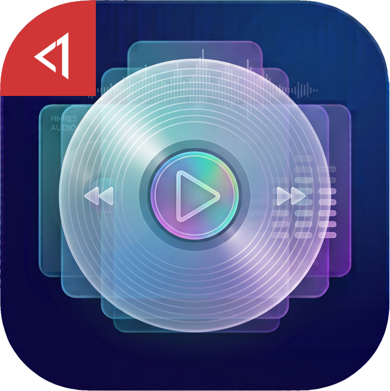
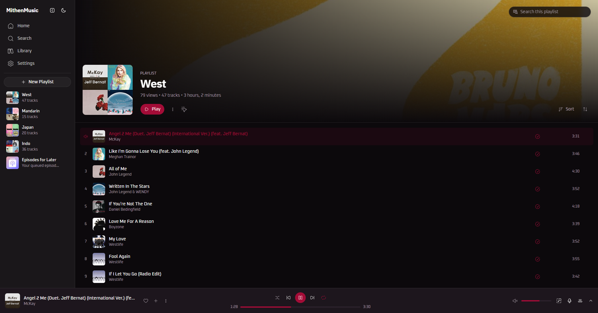

  

<h1 align="center">MithenMusic</h1>

MithenMusic is a native desktop audio player + YouTube Music client for Windows, with ad-free playback and lyrics support. A Windows focused fork of <a href="https://github.com/SimoHypers/limusic">SimoHypers's Limusic</a>

## Additional features in this fork
* Windows focused features and configuration
* Better support for local music files (double click local file to play)
* Support thumbnail generation on Windows Explorer for album arts
* Global hotkeys (`Ctrl + Space` play/pause, `Ctrl + N` next, `Ctrl + P` previous, `Ctrl + =` / `Ctrl + -` volume, `Ctrl + Alt + W` show/hide)
* Added hotkey list in the settings
* Added `Ctrl+I` hotkey to show track information
* Moved `Shuffle Play` out of submenu for easier access
* Removes the update checker. Download the newest installer if you want to update.
* Removes Ctrl+ScrollWheel UI resize (zoom in & out)
* Removes Discord integration
* Removes Last.fm scrobbling
* Removes Listen Together
* Removes Recent search history (for privacy reasons)
* Removes the in-app language picker; the language is chosen once, by the installer

## Screenshot

## Supported platforms
* Windows 10+ (x64). The WebView2 runtime is required and ships with Windows 10 (April 2018+) and Windows 11.

## Part of MithenApps
* No telemetry
* No changing language after installation (lighter)
* No update checking (use it as a tool, update it when you find issues only)
* Uninstalls cleanly, no leftovers
* Prioritizing user-ergonomics

## Credits
* [SimoHypers](https://github.com/SimoHypers) - author of [Limusic](https://github.com/SimoHypers/limusic), which MithenMusic is a fork of.
